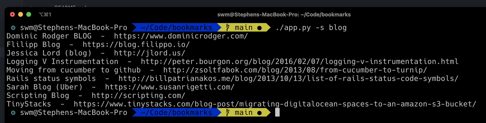

# BM - Bookmark Manager



## Description

BM is a command-line utility, written in Python, that provides an easy way to manage and distribute/sync my list of bookmarks to my work and personal machines as well as several servers I frequently use. As a user, I have found it incredibly beneficial in maintaining my workflow, particularly in an environment where browser sync and third-party apps present challenges.

## Why?

I wrote this bookmarking app for a specific reason: I was working at $BIG_CORP, a company with a stringent security policy that locked down my laptop. Syncing bookmarks through my browser became impossible, and the process of getting a third-party app installed was fraught with too much hassle.

Moreover, as a terminal user/nerd, I always strive to stay within the terminal as much as possible to maintain my workflow. This scenario led me to create BM - a simple and efficient solution to manage bookmarks within the terminal, making it possible to add and search bookmarks easily and quickly.

## Features

- **Search bookmarks**: Easily find your saved bookmarks.

## Planned Features

- **Add bookmarks**: Add bookmarks to your list with a single command.

## Installation

This project requires Python 3.6+ to run. Clone this repository and install the dependencies using pip.

```bash
git clone https://github.com/swmcc/bm.git
cd bm
pip install -r requirements.txt
```

## Usage

Ensure you have your credentials for the PULP handy and export them as environment variables:

```bash
export PULP_USERNAME=XXXXXXXXXXXX
export PULP_PASSWORD=XXXXXXXXXXXX
```

```bash

Here's how you can search bookmarks:

```bash
# Search for a bookmark
./app.py -s <term>
```

I highly recommend creating an alias for the app to make it easier to use. For example, you can add the following to your `.bashrc` file:

```bash
ln -s /path/to/bm/app.py <somwhere in your PATH>/bm
```

Then your usage would look like this:

```bash
bm -s <term>
```

This would allow you to use the app from anywhere in your terminal as well as autocomplete the command.

## Contribution

This project is open for improvements and bugfixes. Feel free to open an [issue](https://github.com/swmcc/bm/issues) or send a [pull request](https://github.com/swmcc/bm/pulls).

## Disclaimer

This tool was created for personal use within the constraints of my work environment at $BIG_CORP. I bear no responsibility if you choose to use it in a similar restrictive environment. Always ensure you are adhering to your company's IT policies when using tools of this nature. You can clone the [PULP](https://github.com/swmcc/pulp) app to your own server and use this tool to manage your bookmarks.

## Acknowledgments

- To $BIG_CORP, for providing the unique environment that inspired the creation of BM.
